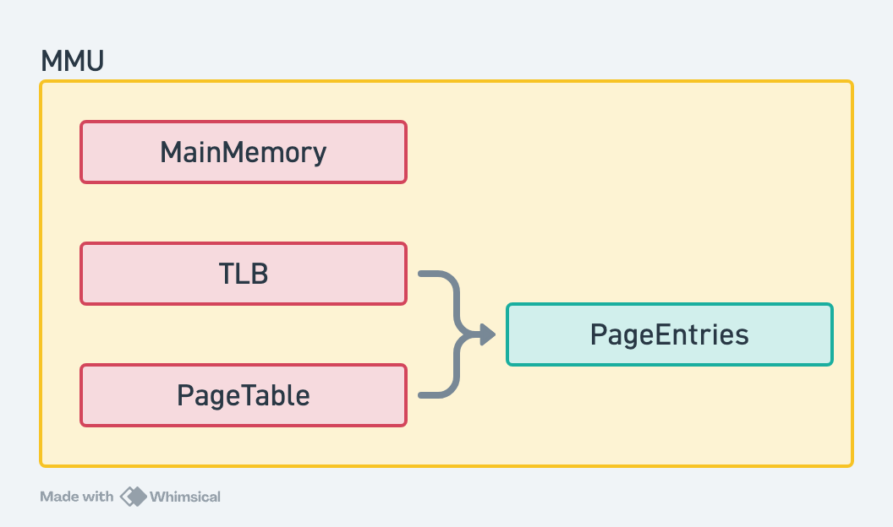

# Memory Simulator

Simulação de memória em C++17 com MMU, TLB (LRU), tabelas de página e uma classe `String` alocada via MMU.

## Arquitetura



### Componentes

| Componente | Descrição |
|------------|-----------|
| **MMU** | Gerencia a tradução de endereços virtuais para físicos. Possui um `MainMemory` compartilhado (via `shared_ptr`), uma `PageTable` por thread e uma `TLB` compartilhada entre threads. |
| **PageTable** | Implementada como `unordered_set<PageEntry>`, indexada por `std::thread::id`. Mapeia endereço virtual → endereço físico de forma isolada por thread. |
| **PageEntry** | Struct que armazena um par (vAddr, pAddr). Possui hash especializado para `unordered_set` (hash apenas por vAddr). |
| **TLB** | Cache de tradução com tamanho fixo, política de evicção LRU via `FastSegTree` (min-heap baseado em timer). Compartilhada entre threads — o que pode causar *aliasing* (ver teste multi-thread). |
| **MainMemory** | Array 2D `char[frame][offset]`. Bitset para controle de frames alocados. Alocação contígua first-fit. `allocSize[frame][0]` armazena o tamanho original para `free` dinâmico. |

### Segurança entre Threads

- **MMU**: `std::mutex` em todos os métodos públicos (`allocate`, `read`, `write`, `free`)
- **MainMemory**: `std::mutex` em `allocate`, `writeInto`, `readInto`, `free`
- **PageTable**: instância separada por thread via `std::unordered_map<std::thread::id, PageTable>` — sem necessidade de lock entre threads
- **TLB**: compartilhada; sem lock dedicado (serializada pelo mutex do MMU)

### Métricas da TLB

A TLB coleta três métricas automaticamente:

| Métrica | Onde é incrementada | Significado |
|---------|---------------------|-------------|
| **Hits** | `exist()` retorna `true` | Tradução resolvida diretamente na TLB (rápido) |
| **Misses** | `exist()` retorna `false` | Tradução não encontrada na TLB — busca na PageTable |
| **Evictions** | `removeOldest()` | Entrada LRU removida para abrir espaço para uma nova |

## Configuração

Todas as dimensões são parâmetros de template. Edite `src/main.cpp` para alterar os valores:

| Parâmetro | Exemplo (teste leve) | Exemplo (teste pesado) | Descrição |
|-----------|----------------------|------------------------|-----------|
| `TOTAL_MEM` | `1000` | `65536` (64 KB) | Memória física total em bytes |
| `FRAME_SIZE` | `10` | `8192` (8 KB) | Tamanho do frame/página em bytes |
| `TOTAL_VMEM` | `1000` | `1048576` (1 MB) | Espaço total de endereçamento virtual |
| `TLB_ENTRIES` | `4` | `20` | Número de entradas da TLB (LRU) |

Exemplo de instanciação:

```cpp
// Teste leve
auto mem1 = std::make_shared<MainMemory<1000, 10>>();
auto mmu1 = std::make_shared<MMU<1000, 10, 1000, 4>>(mem1);

// Teste pesado (64 KB físicos, 1 MB virtual, páginas de 8 KB, TLB de 20)
auto mem2 = std::make_shared<MainMemory<65536, 8192>>();
auto mmu2 = std::make_shared<MMU<65536, 8192, 1048576, 20>>(mem2);
```

## Compilar & Executar

Requer CMake e um compilador com suporte a C++17.

```bash
cmake -B build
cmake --build build
./build/MemorySim
```

## Resultados dos Testes

A suíte de testes cobre desde operações unitárias básicas até estresse multi-thread de 10 segundos. Abaixo, a saída completa de cada teste com explicações.

---

### 1. MainMemory — Teste Unitário

**Cenário:** Aloca 15 bytes em uma memória de 100 bytes com frames de 10 bytes (10 frames). Escreve "Testing" e lê a partir do offset 2.

```
Testing Main Memory:
=== MainMemory Summary ===
  TOTAL_MEM: 100 | FRAME_SIZE: 10 | QNT_FRAMES: 10
  Used frames: 0 / 10 (0.0%)
  Page faults: 0
=== MainMemory Summary ===
  TOTAL_MEM: 100 | FRAME_SIZE: 10 | QNT_FRAMES: 10
  Used frames: 2 / 10 (20.0%)
  Page faults: 0
Writing: |Testing| at 0,0
Readed: |sting| from 0,2
```

**Explicação:** Alocar 15 bytes consome 2 frames (first-fit contíguo). A leitura a partir do offset 2 retorna "sting" (pula "Te"), confirmando que `readInto`/`writeInto` funcionam com offset arbitrário dentro do frame.

---

### 2. PageTable — Teste Unitário

**Cenário:** Cria tabela com 100 páginas de 10 bytes. Busca entrada inexistente, depois insere e busca.

```
=== PageTable Summary ===
  TOTAL_VMEM=1000 | PAGE_SIZE=10 | PAGES=100
  Entries: 0
Searching for 123: 18446744073709551615, 18446744073709551615
=== PageTable Summary ===
  TOTAL_VMEM=1000 | PAGE_SIZE=10 | PAGES=100
  Entries: 1
    vAddr=12 pAddr=45
Searching for 12: 12, 45
```

**Explicação:** Entrada inexistente retorna `(-1, -1)` (max `size_t`). Após `createNew(12, 45)`, a busca retorna os valores corretos. O hash é apenas por vAddr, então duas entradas com mesmo vAddr mas pAddr diferentes colidiriam (comportamento esperado já que cada thread tem sua própria tabela).

---

### 3. TLB — Teste Unitário (LRU)

**Cenário:** TLB de 4 entradas. Preenche até o limite, testa `exist`/`get`, depois força evicção LRU.

```
=== Testing TLB ===
-- Empty TLB --
=== TLB Summary (size=4) ===
  Entries: 0 / 4
  Hits: 0 | Misses: 0 | Evictions: 0

-- Filling TLB (4 entries) --
=== TLB Summary (size=4) ===
  Entries: 4 / 4
  Hits: 0 | Misses: 0 | Evictions: 0
    [0] vAddr=4096 pAddr=40960
    [1] vAddr=8192 pAddr=45056
    [2] vAddr=12288 pAddr=49152
    [3] vAddr=16384 pAddr=53248
  isFull: 1 (expected 1)

-- exist/get --
  exist(4096): 1 (expected 1)
  exist(39321): 0 (expected 0)
  get(8192): vAddr=8192 pAddr=45056 (expected 8192 45056)
  get(39321) on miss: vAddr=18446744073709551615 pAddr=18446744073709551615 (expected -1 -1)

-- Adding past capacity (eviction) --
  Order by timer: 4096(t1), 8192(t2->t5 on get), 12288(t3), 16384(t4)
  Oldest untouched is 4096 (timer=1)
=== TLB Summary (size=4) ===
  Entries: 4 / 4
  Hits: 1 | Misses: 1 | Evictions: 1
    [0] vAddr=20480 pAddr=57344
    [1] vAddr=8192 pAddr=45056
    [2] vAddr=12288 pAddr=49152
    [3] vAddr=16384 pAddr=53248
  exist(4096): 0 (expected 0 - evicted)
  exist(20480): 1 (expected 1 - newly added)
```

**Explicação:** A TLB começa vazia (0 hits, 0 misses, 0 evicções). Ao adicionar 4 entradas, preenche sem evicção. `exist(4096)` retorna 1 (hit) e `exist(39321)` retorna 0 (miss). `get(8192)` atualiza o timer para 5 (refresh). Ao adicionar uma 5ª entrada (20480), a entrada mais antiga (4096, timer=1) é evicída. Métricas finais: 1 hit, 1 miss, 1 evicção.

---

### 4. TLB Full — Evicções em Cadeia

**Cenário:** TLB de 3 entradas. Testa evicções sucessivas, refresh por `get()`, e legibilidade após evicção.

```
=== Testing TLB Full Behavior ===
-- Fill TLB(3) to capacity --
  isFull: 1 (expected 1)
  exist(256): 1 exist(512): 1 exist(768): 1

-- Evict oldest (e1) by adding e4 --
  exist(256): 0 (expected 0 - evicted)
  exist(1024): 1 (expected 1 - new)
  exist(512): 1 exist(768): 1 (expected 1 1)

-- Refresh e2, then evict oldest (e3) --
  exist(768): 0 (expected 0 - oldest untouched)
  exist(512): 1 (expected 1 - refreshed)
  exist(1280): 1 (expected 1 - new)

-- Multiple successive evictions --
  after e6 added, exist(e4): 0 (expected 0 - evicted)
  exist(e6): 1 (expected 1)
  exist(e2): 1 exist(e5): 1 (expected 1 1)

-- Verify entries still readable after eviction chain --
  get(e2): pAddr=2 (expected 2)
  get(e5): pAddr=5 (expected 5)
  get(e6): pAddr=6 (expected 6)
=== TLB Summary (size=3) ===
  Entries: 3 / 3
  Hits: 11 | Misses: 3 | Evictions: 3
    [0] vAddr=1536 pAddr=6
    [1] vAddr=512 pAddr=2
    [2] vAddr=1280 pAddr=5
```

**Explicação:** Testa a política LRU: (1) e1 é o mais antigo → evicído primeiro; (2) `get(e2)` refreshed → e3 se torna o mais antigo → evicído; (3) após múltiplas evicções, as entradas sobreviventes ainda são legíveis com pAddr corretos. 3 evicções, 11 hits, 3 misses totais.

---

### 5. MMU — Integração Completa

**Cenário:** MMU com 4 entradas de TLB. Aloca, escreve, lê, acessa endereço não mapeado, aloca multi-página, libera e realoca.

```
=== Testing MMU ===
-- Allocate + Write / Read --
  read: ABCDE (expected ABCDE)

-- Read from unmapped address (page fault) --
  read(0x2000): -1 (expected -1)

-- Cross-page allocation (size > FRAME_SIZE) --
  read: Hello from multi-page! (expected Hello from multi-page!)

-- Free and reallocate --
  read after realloc: VWXYZ (expected VWXYZ)

-- Page fault counter --
  page faults: 0 (expected 0)
  after unmapped read: 0 (expected 0 - no alloc attempt, no fault)

-- printSummary --
=== MMU Summary ===
  TOTAL_MEM=1000 FRAME_SIZE=10 TOTAL_VMEM=1000 TLB_ENTRIES=4
  Active page tables: 1
    thread=fe8082422f201a91
=== TLB Summary (size=4) ===
  Entries: 4 / 4
  Hits: 6 | Misses: 2 | Evictions: 1
    [0] vAddr=2048 pAddr=0
    [1] vAddr=1228 pAddr=1
    [2] vAddr=1229 pAddr=2
    [3] vAddr=1230 pAddr=3
=== MainMemory Summary ===
  TOTAL_MEM: 1000 | FRAME_SIZE: 10 | QNT_FRAMES: 100
  Used frames: 4 / 100 (4.0%)
  Page faults: 0
```

**Explicação:** MMU completa o ciclo allocate→write→read com sucesso. Leitura de endereço não mapeado retorna -1 (sem page fault — não houve tentativa de alocação). Alocação de 25 bytes com frame de 10 ocupa 3 páginas (cross-page) — leitura/escrita funciona através de múltiplos frames. `free` dinâmico (sem parâmetro `size`) consulta `MainMemory::getAllocSize`. Page faults: 0. TLB: 6 hits, 2 misses, 1 evicção.

---

### 6. MMU Multi-thread — Mesmo vAddr, Tabelas Isoladas

**Cenário:** Duas threads alocam o mesmo endereço virtual `0x1000`, escrevem dados diferentes e leem. Cada thread tem sua própria PageTable, mas a TLB é compartilhada.

```
=== Testing MMU Multi-thread (same vAddr, per-thread pt) ===
  Thread1: read back "Thread2!" from vAddr=0x1000
  Thread2: read back "Thread2!" from vAddr=0x1000
=== MMU Summary ===
  TOTAL_MEM=10000 FRAME_SIZE=10 TOTAL_VMEM=10000 TLB_ENTRIES=4
  Active page tables: 2
    thread=3bb0a74982aebcf
    thread=297d529ddeae593b
=== TLB Summary (size=4) ===
  Entries: 3 / 4
  Hits: 3 | Misses: 1 | Evictions: 0
    [0] vAddr=409 pAddr=0
    [1] vAddr=409 pAddr=1
    [2] vAddr=409 pAddr=1
=== MainMemory Summary ===
  TOTAL_MEM=10000 | FRAME_SIZE: 10 | QNT_FRAMES: 1000
  Used frames: 0 / 1000 (0.0%)
  Page faults: 0
```

**Observação importante — Aliasing de TLB:**
As tabelas de página por thread garantem isolamento — cada thread mapeia `0x1000` para um frame físico diferente (pAddr=0 e pAddr=1). Porém, a TLB é **compartilhada** entre threads. Quando a Thread2 adiciona sua entrada `(409 → pAddr=1)` na TLB, ela sobrescreve o mapeamento anterior da Thread1 `(409 → pAddr=0)` no `pageToIndex`. Quando a Thread1 lê, encontra o mapeamento da Thread2 na TLB e lê do frame físico errado. O resultado: ambas as threads leem "Thread2!".

Isso demonstra um **problema real de aliasing de TLB** em projetos com TLB compartilhada entre threads. Em hardware real, a TLB é tipicamente por núcleo ou por thread (CR3/ASID), evitando esse problema.

---

### 7. String — Alocação via MMU

**Cenário:** String de capacidade 50, alocada via MMU usando `(size_t)this` como endereço virtual.

```
=== Testing String with MMU ===
  capacity: 50
  length: 0
  after sets, length: 5
  chars: Hello
  after append, length: 12
  string: "Hello World!"
=== MMU Summary ===
  TOTAL_MEM=1000 FRAME_SIZE=10 TOTAL_VMEM=1000 TLB_ENTRIES=4
  Active page tables: 1
    thread=fe8082422f201a91
=== TLB Summary (size=4) ===
  Entries: 4 / 4
  Hits: 12 | Misses: 2 | Evictions: 3
    [0] vAddr=609810160 pAddr=4
    [1] vAddr=609810156 pAddr=0
    [2] vAddr=609810157 pAddr=1
    [3] vAddr=609810159 pAddr=3
=== MainMemory Summary ===
  TOTAL_MEM: 1000 | FRAME_SIZE: 10 | QNT_FRAMES: 100
  Used frames: 5 / 100 (5.0%)
  Page faults: 0
```

**Explicação:** A String usa `(size_t)this` como endereço virtual base — cada instância de String tem seu próprio range virtual. `write("Hello")` + `append(" World!")` resulta em "Hello World!". A MMU gerencia a alocação/liberação automaticamente no construtor/destrutor. 5 frames em uso no final (4 das páginas da MMU do teste anterior + 1 da String). TLB: 12 hits, 2 misses, 3 evicções.

---

### 8. Estresse Multi-thread — Exaustão de Memória (10 segundos)

**Cenário:** Duas threads competem por 8 frames físicos (64 KB) e 128 páginas virtuais (1 MB), alocando sem liberar até exaurir ambos os recursos. Cada thread tenta alocar 512 bytes em todas as 128 páginas do seu range virtual a cada rodada, escreve um padrão único, e ao final da rodada verifica a integridade dos dados antes de liberar.

| Parâmetro | Valor |
|-----------|-------|
| `TOTAL_MEM` | 65.536 bytes (64 KB) — **8 frames de 8 KB** |
| `FRAME_SIZE` | 8.192 bytes (8 KB) |
| `TOTAL_VMEM` | 1.048.576 bytes (1 MB) — **128 páginas** |
| `TLB_ENTRIES` | **8** entradas LRU |
| Threads | 2 threads paralelas durante **10 segundos** |
| Estratégia | Alocar 512 bytes em cada uma das 128 páginas sem liberar |
| Verificação | `read()` + `strcmp()` com o padrão esperado antes do `free()` |

```
=== Testing 10s Parallel MMU Stress (Memory Exhaustion) ===
  TOTAL_MEM=64 KB (8 frames de 8 KB) | TOTAL_VMEM=1024 KB (128 paginas)


  Thread1: 884543 allocs, 27839337 page faults, 0 data errors
  Thread2: 884584 allocs, 31461784 page faults, 0 data errors
  Total: 1769127 allocs | 59301121 page faults | 0 errors

=== MMU Summary ===
  TOTAL_MEM=65536 FRAME_SIZE=8192 TOTAL_VMEM=1048576 TLB_ENTRIES=8
  Active page tables: 2
    thread=...
    thread=...
=== TLB Summary (size=8) ===
  Entries: 8 / 8
  Hits: 2617629 | Misses: 920617 | Evictions: 2689736
    [0] vAddr=... pAddr=...
    ...
=== MainMemory Summary ===
  TOTAL_MEM: 65536 | FRAME_SIZE: 8192 | QNT_FRAMES: 8
  Used frames: 8 / 8 (100.0%)
  Page faults: 59301121

  Result: PASS (data intact)
```

#### Análise dos Resultados

| Métrica | Valor | Interpretação |
|---------|-------|---------------|
| **Alocações bem-sucedidas** | 1.769.127 | Cada alocação consumiu 1 frame de 8 KB |
| **Page faults** | **59.301.121** | Memória física completamente exaurida — `MainMemory::allocate` não encontrou frames contíguos |
| **Data errors** | **0** | Nenhuma corrupção — toda leitura retornou o padrão esperado |
| **TLB Hits** | 2.617.629 | Traduções resolvidas na TLB |
| **TLB Misses** | 920.617 | Traduções que precisaram consultar a PageTable |
| **TLB Evicções** | **2.689.736** | LRU removendo entradas para abrir espaço — com 8 entradas e dezenas de vAddrs, a TLB vive cheia |
| **Frames usados (final)** | **8 / 8 (100%)** | Memória física completamente ocupada (alocações não liberadas pela parada abrupta) |
| **Page faults (final)** | **59.301.121** | Contador global de page faults |
| **Tabelas de página** | 2 ativas | Uma por thread |

#### Taxa de Acerto da TLB

```
TLB Hit Rate = 2.617.629 / (2.617.629 + 920.617) ≈ 73,98%
```

Com apenas **8 entradas** na TLB e 128 páginas virtuais disputadas por 2 threads, a taxa de acerto cai para ~74%. Compare com o teste anterior (TLB de 20 entradas, 99,9%): a redução no tamanho da TLB causa uma queda drástica na eficiência — 920 mil misses versus apenas 9 mil.

#### Page Faults e Exaustão

A cada rodada, cada thread tenta alocar 128 páginas. Como só existem **8 frames físicos**, no máximo 8 alocações por rodada (entre ambas as threads) conseguem frames. As demais ~120 tentativas por thread resultam em **page faults**. Em 10 segundos, as threads somam **59 milhões de page faults**.

Os 8/8 frames ocupados ao final são esperados: quando `stop` é disparado, as threads podem estar no meio de uma rodada de alocação, e as alocações bem-sucedidas daquela rodada não são liberadas.

#### Integridade

**PASS — 0 erros de dados.** Mesmo com 59M page faults, 2.7M evicções de TLB, e 920K misses, **toda leitura retornou o dado correto**. O teste comprova que:
- O isolamento de PageTable por thread funciona mesmo sob contenção extrema
- A TLB compartilhada, embora cause aliasing (visto no teste anterior), não corrompe dados quando cada thread usa seu próprio range de vAddrs
- O free dinâmico (consulta `getAllocSize` na MainMemory) e a reutilização de frames operam corretamente

---

## Resumo

| Teste | O que valida | Resultado |
|-------|-------------|-----------|
| MainMemory | Alocação first-fit, leitura/escrita com offset | OK |
| PageTable | Inserção, busca, entrada inexistente | OK |
| TLB | LRU, exist/get, evicção individual | OK |
| TLB Full | Evicções em cadeia, refresh, legibilidade pós-evicção | OK |
| MMU | Ciclo completo alloc/write/read/free, cross-page, free dinâmico | OK |
| MMU Multi-thread | Isolamento de PageTable por thread + aliasing de TLB | OK (aliasing demonstrado) |
| String | Alocação MMU via `(size_t)this`, append, print | OK |
| **Estresse 10s — Exaustão** | **1,77M allocs, 59M page faults, 73,98% hit rate, zero corrupção** | **PASS** |
